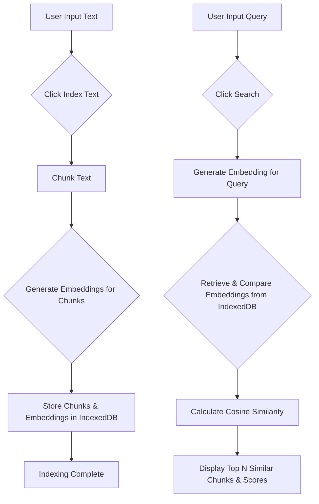

# RAG Logic Tester

This project demonstrates the core logic of a Retrieval-Augmented Generation (RAG) system entirely on the client-side. It utilizes Hugging Face Transformers.js for generating text embeddings and IndexedDB for local storage of these embeddings and text chunks.

## Features

- **Text Indexing:** Paste large texts, which are automatically chunked, embedded, and stored locally.
- **Semantic Search:** Query the indexed text to retrieve the most semantically relevant chunks.
- **Client-Side Operation:** All RAG logic, including embedding generation and data storage, runs directly in your browser, ensuring privacy and offline capabilities.

## How It Works

1.  **Embedding Generation:** The application uses the `Xenova/all-MiniLM-L6-v2` model from Hugging Face, loaded via their Transformers.js library. It prefers WebGPU for faster processing, falling back to WebAssembly (WASM) if WebGPU is unavailable.
2.  **Text Chunking:** Input text is split into smaller, manageable chunks with a defined overlap.
3.  **IndexedDB Storage:** Each chunk's content and its corresponding embedding vector are saved in your browser's IndexedDB for persistence.
4.  **Cosine Similarity Search:** When a query is entered, its embedding is generated. This query embedding is then compared against all stored chunk embeddings using cosine similarity to find the most relevant matches.

## Usage

1.  Open `index.html` in your web browser.
2.  **Indexing:** In the "Indexing" section, paste the text you wish to analyze into the textarea and click "Index Text".
3.  **Searching:** Once indexing is complete, type your search query into the "Searching" input field and click "Search" to see the most relevant text chunks and their similarity scores.

## Development

This project is built with:

-   HTML
-   CSS
-   JavaScript (ESM)
-   Hugging Face Transformers.js (`@huggingface/transformers`)
-   IndexedDB API

To run locally, simply open the `index.html` file in your browser.

## Project Flow (Mermaid Diagram)

